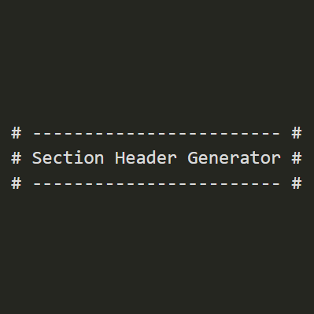

# Section Header Generator

[](https://github.com/0xMshari/section-header-extension)
[](https://opensource.org/licenses/MIT)

A VS Code/Cursor extension that helps you organize your code with beautiful, properly formatted section headers.



## Features

- **Clean Section Headers:** Automatically generates well-formatted section headers like:

```
# -------------------------------------------------------------------------------------------------------------------- #
#                                              App Custom Configurations                                               #
# -------------------------------------------------------------------------------------------------------------------- #
```

- **Language-Aware:** Adapts to different file types with the appropriate comment syntax:
  - Python/YAML/Shell: `# ... #`
  - JavaScript/TypeScript/C/Java: `// ... //`
  - HTML/XML: `<!-- ... -->`
  - CSS/SCSS: `/* ... */`

- **Smart Indentation:** Maintains proper indentation in all languages, especially Python
- **Flexible Usage:** Works with or without text selection

## Installation

### From VS Code Marketplace
*Coming soon*

### From VSIX File
1. Download the latest `.vsix` file from the [Releases](https://github.com/0xMshari/section-header-extension/releases) page
2. In VS Code/Cursor, go to Extensions view (Ctrl+Shift+X)
3. Click the "..." (More Actions) button at the top of the Extensions view
4. Select "Install from VSIX..."
5. Choose the downloaded `.vsix` file

### Building from Source
```bash
git clone https://github.com/0xMshari/section-header-extension.git
cd section-header-extension
npm install
npm run package
# The .vsix file will be generated in the root directory
```

## Usage

1. Open any file in VS Code or Cursor
2. Press `Ctrl+Shift+Alt+H` (Windows/Linux) or `Cmd+Shift+Alt+H` (Mac)
3. The extension works in two ways:
   - If text is selected: The selected text will be used as the header content
   - If no text is selected: You'll be prompted to enter header text
4. The formatted header will be inserted at your cursor position, maintaining proper indentation

## Examples

### Python
```python
# ---------------------------------------------- #
#               Database Connection              #
# ---------------------------------------------- #

def connect_to_db():
    # Implementation
```

### JavaScript
```javascript
// ---------------------------------------------- //
//             Authentication Methods             //
// ---------------------------------------------- //

function authenticate() {
    // Implementation
}
```

## Contributing

Contributions are welcome! Feel free to:

1. Fork the repository
2. Create a feature branch (`git checkout -b feature/amazing-feature`)
3. Commit your changes (`git commit -m 'Add some amazing feature'`)
4. Push to the branch (`git push origin feature/amazing-feature`)
5. Open a Pull Request

## License

This project is licensed under the MIT License - see the [LICENSE](LICENSE) file for details.

## Acknowledgments

- Inspired by the need for clean, consistent code organization
- Thanks to all the developers who provide feedback and suggestions
